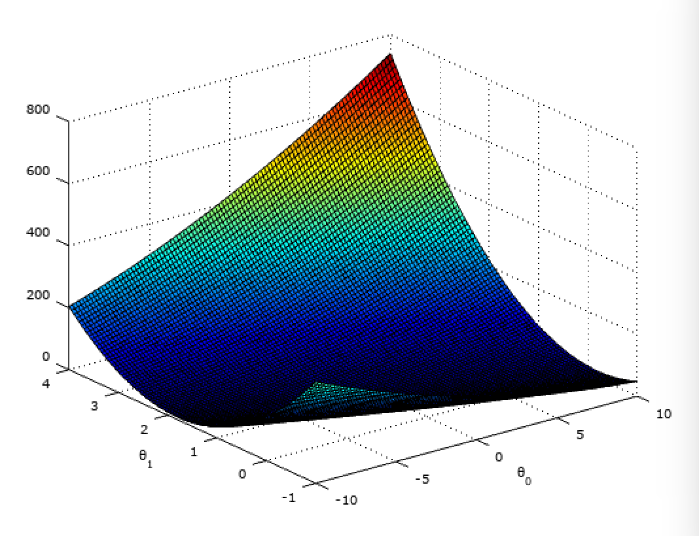
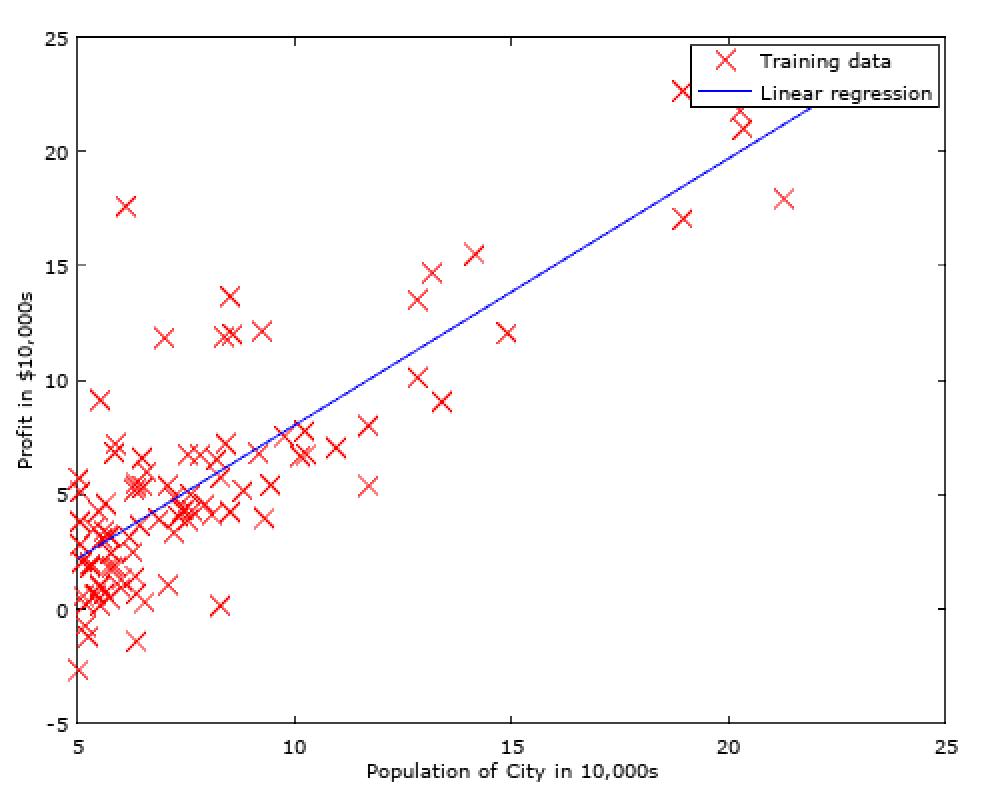
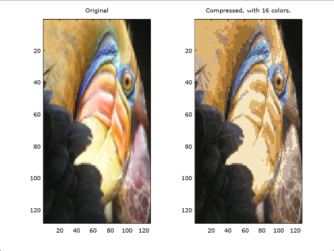

##Stanford Online's Machine Learning course by Andrew Ng##

___

In this repository you can find my results of all projects and relevant exercises of the Stanford Online's Machine Learning course developed by professor Andrew Ng.
___

###About###

This 11 week course imparts the knowledge about several machine learning techniques for all sorts of mundane business and industry tasks, from predicting sales based upon recorded data via automatic clustering of social groups, detecting anomalies within a production chain or building complex multi-component machine learning solutions and optimzing them.

###Content###

* **Week 1 - Intro**
    * Introduction
    * What is Machine Learning, where it can be applied? What is supervised and unsupervised learning?
    * Linear algebra refresher
* **Week 2 - Linear regression**
    * Introduction to Matlab/GNU Octave
    * Linear Regression
    *  
* **Week 3 - Logistic regression and classification**
    * Logistic regression, single and multi-class classification
    * Regularized linear regression
    *  
* **Week 4 - Neural networks**
    * Non-linear representations, neurons, the brain and neural networks
    * 
* **Week 5 - Backpropagation**
    * Backpropagation, cost functions and the importance of well fit random initialization for successfull symetry breaking
    *  
* **Week 6 - Error metrics and bias vs variance**
    * Evaluating a hypothesis
    * Diagnosing Bias Vs Variance
    * Error metrics for skewed classes : Precision Vs Recall
    * 
* **Week 7 - Support Vector Machines for classifications**
   * Support Vector Machines (SVMs) - Large Margin Classification
   *  
* **Week 8 - Unsupervised learning and dimension reduction**
   * K-Means Algorithm - Unsupervised learning to detect clusers using features and data compression
   * Principal Component Analysis (PCA) for data compression, accelerated learning and easier visualization.
   *   
* **Week 9 - Anomaly detection and collaborative filtering**
    * Gaussian Distribution and Multivariate Gaussian Distribution to detect anoamlies (such as damaged engines, suspect people etc.)
    * Predicting movie ratings using collaborative filtering
    *  
* **Week 10 - Big Data**
    * Big Data - Learning with large data sets via stochastic gradient descent, mini batches, online learning and map reduce techniques.
* **Week 11 - Machine learning architectures and theirs optimization using an example of a photo OCR**
    * Architecture and optimization of the pipelineof a Photo OCR (text detection) application.