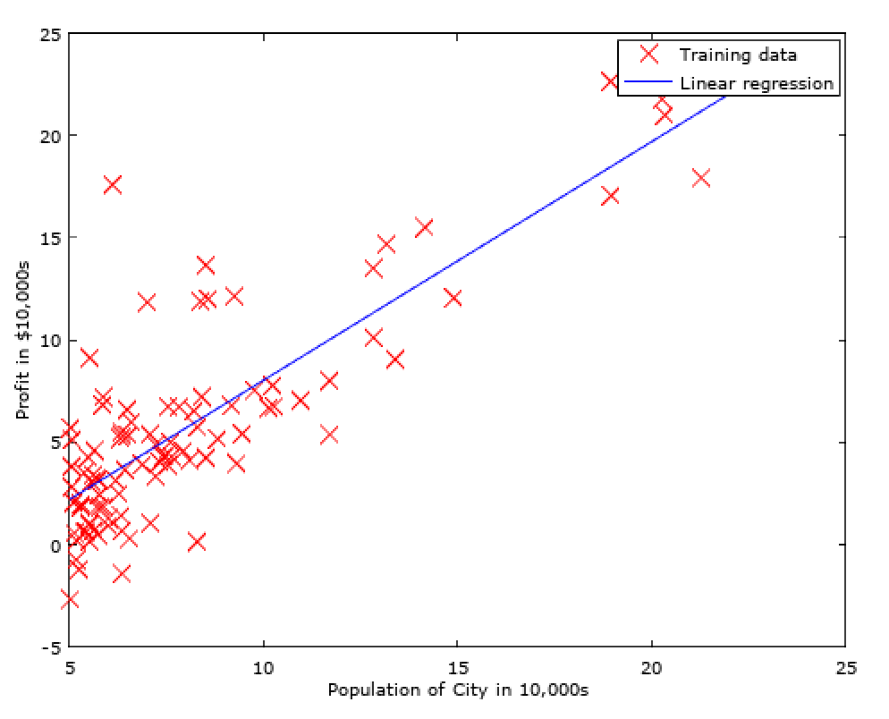
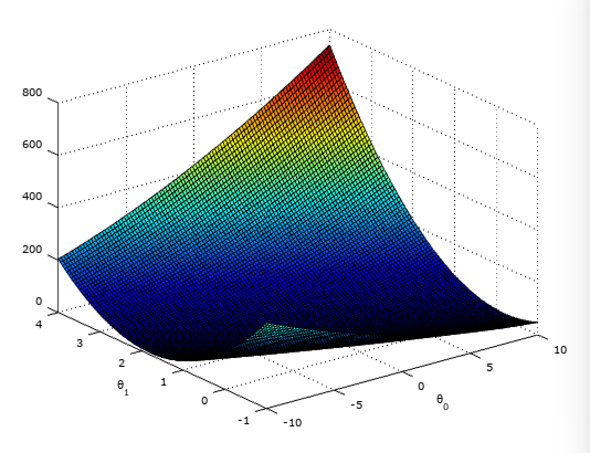
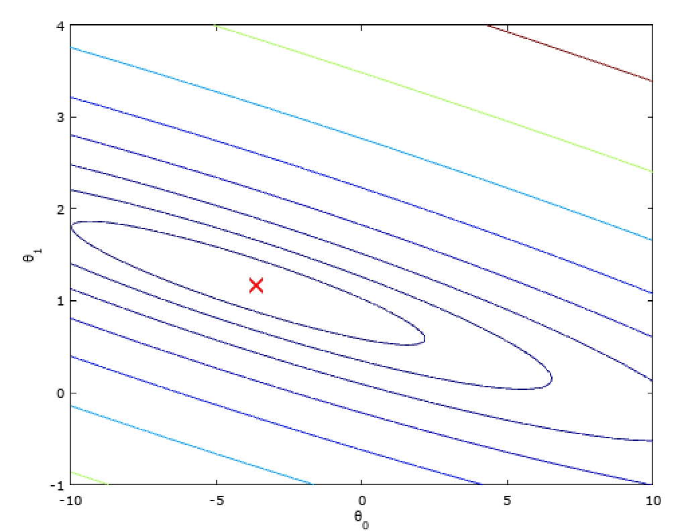
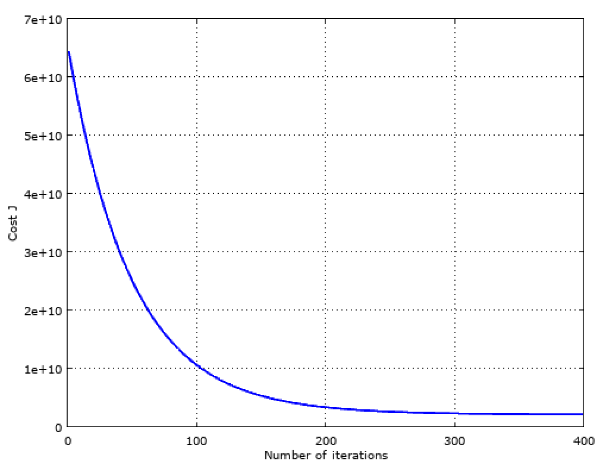

## Week 2 - Project 1 ##

### Linear regression ###



This is the first project of the Stanford Machine Learning course in which with the help of gradient descent based machine learning approach the relation between the population of a city and it's potential profit shall be found.




### Optional part - Multivariate linear regression ###

In this second, optional part the relation between the space of a house, it's bathroom count and it's price shall be found via multivariate gradient descent.

Alternatively - as this is a linear regression problem - this problem is easily solvable without iteration steps too by using the normal equation.



```Loading data ...
First 10 examples from the dataset:
 x = [2104 3], y = 399900
 x = [1600 3], y = 329900
 x = [2400 3], y = 369000
 x = [1416 2], y = 232000
 x = [3000 4], y = 539900
 x = [1985 4], y = 299900
 x = [1534 3], y = 314900
 x = [1427 3], y = 198999
 x = [1380 3], y = 212000
 x = [1494 3], y = 242500
Program paused. Press enter to continue.
Normalizing Features ...
Running gradient descent ...
Theta computed from gradient descent:
 334302.063993
 100087.116006
 3673.548451

house_with_1650_and_3_br =

   1.00000  -0.44127  -0.22368

Predicted price of a 1650 sq-ft, 3 br house (using gradient descent):
 $289314.620338
Program paused. Press enter to continue.
Solving with normal equations...
theta =

   8.9598e+04
   1.3921e+02
  -8.7380e+03

Theta computed from the normal equations:
 89597.909544
 139.210674
 -8738.019113

house_with_1650_and_3_br =

      1   1650      3

Predicted price of a 1650 sq-ft, 3 br house (using normal equations):
 $293081.464335
```