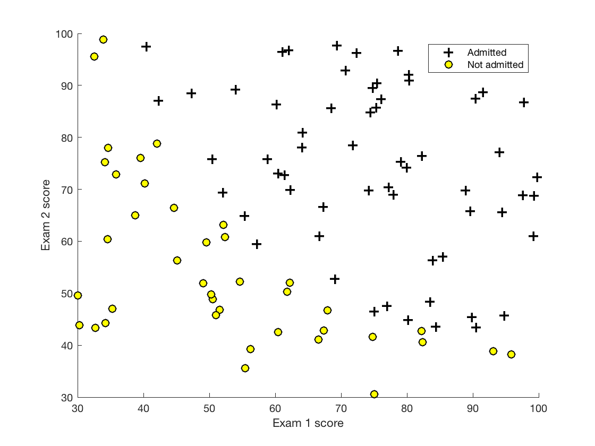
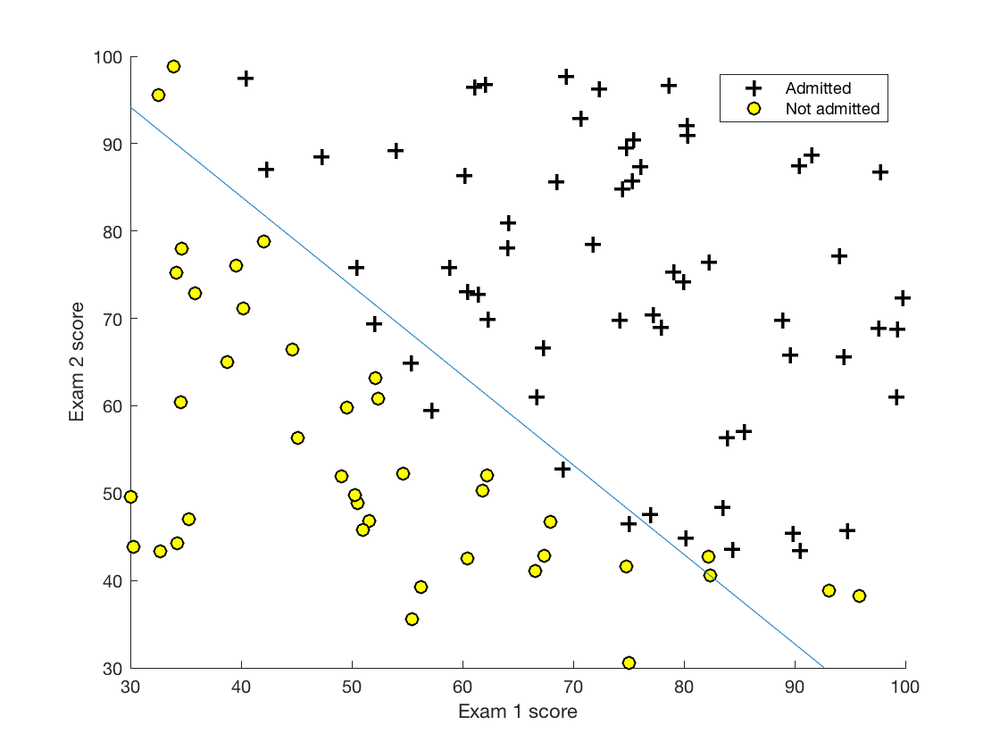
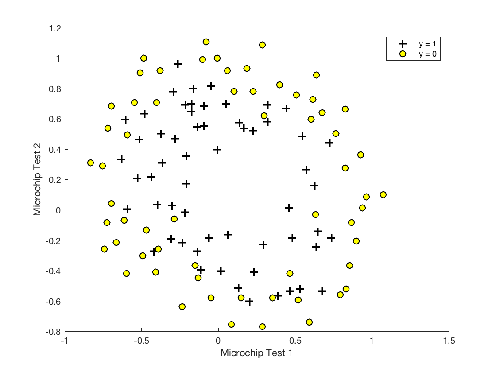
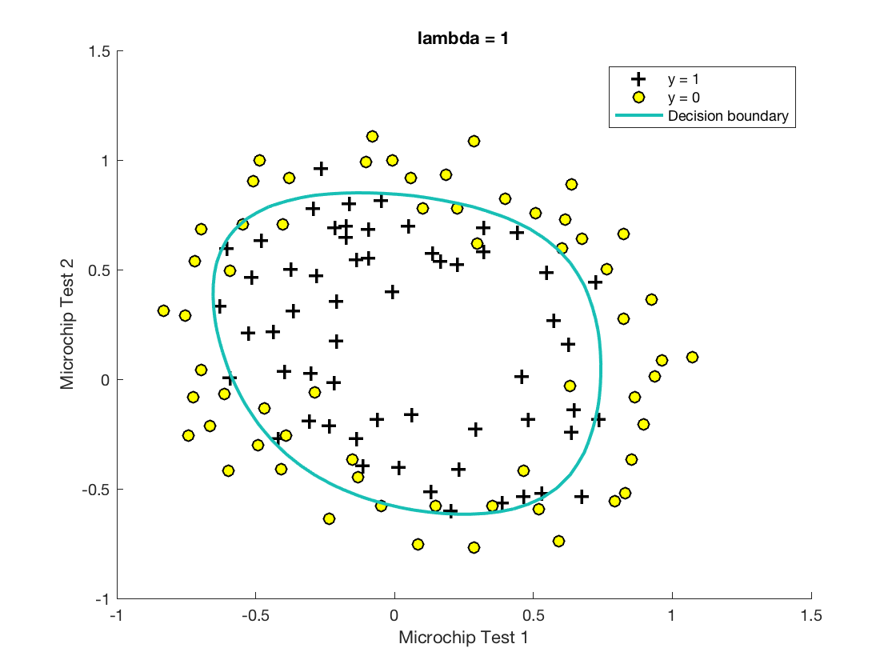

## Week 3 - Project 2 ##

### Logistic regression and binary classification  ###



This is the second project of the Stanford Machine Learning degree in which the techniques of the previous example are extended to solve more complex, non-linear classification problems.

### Part 1 ###

The task of part 1 was to classify a simple but non-linear data set of students. The alogithm predicts the likeliness of the commitment depending on theirs first two given grades:



```
Cost at initial theta (zeros): 0.693147
Expected cost (approx): 0.693
Gradient at initial theta (zeros): 
 -0.100000 
 -12.009217 
 -11.262842 
Expected gradients (approx):
 -0.1000
 -12.0092
 -11.2628

Cost at test theta: 0.218330
Expected cost (approx): 0.218
Gradient at test theta: 
 0.042903 
 2.566234 
 2.646797 
Expected gradients (approx):
 0.043
 2.566
 2.647

Cost at theta found by fminunc: 0.203506
Expected cost (approx): 0.203
theta: 
 -24.932758 
 0.204406 
 0.199616 
Expected theta (approx):
 -25.161
 0.206
 0.201

Program paused. Press enter to continue.
For a student with scores 45 and 85, we predict an admission probability of 0.774321
Expected value: 0.775 +/- 0.002

Train Accuracy: 89.000000
Expected accuracy (approx): 89.0
```

### High dimensional problems ###

	

The task of the second problem was to use a very high dimensional data set, created by feature mapping, to predict more complex situations.
To prevent excessive overfitting quickly caused by using high dimensional features a regularization method needed to be implemented.



```Expected cost (approx): 0.693
Gradient at initial theta (zeros) - first five values only:
 0.008475 
 0.018788 
 0.000078 
 0.050345 
 0.011501 
Expected gradients (approx) - first five values only:
 0.0085
 0.0188
 0.0001
 0.0503
 0.0115
 
Train Accuracy: 83.050847
Expected accuracy (with lambda = 1): 83.1 (approx)
```